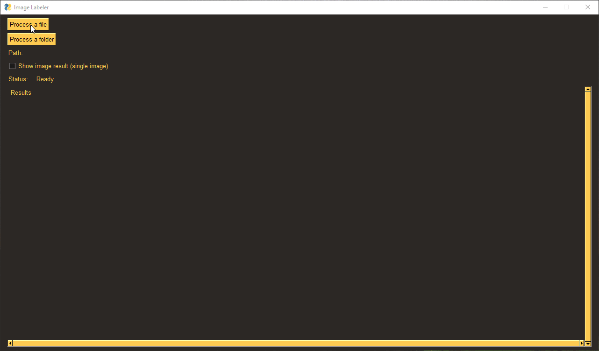

# Image Labeler

Renames pictures based on the text in them using PaddleOCR. 

# Usage
Install [PaddleOCR](https://github.com/PaddlePaddle/PaddleOCR/blob/release/2.6/doc/doc_en/quickstart_en.md).  
Command line: Run `main.py` directly or with `--file=filename.jpg` or `--dir=directory`.  
GUI: Run `gui_simple.py`

# To-do
- [ ] Image preview in GUI with
- [ ] Ability to accept/reject filename
- [ ] Rename existing files instead of copying
- [ ] Object/content recognition (maybe)
- [ ] Add more comments

# Libraries used
- PaddleOCR
- PySimpleGUI

